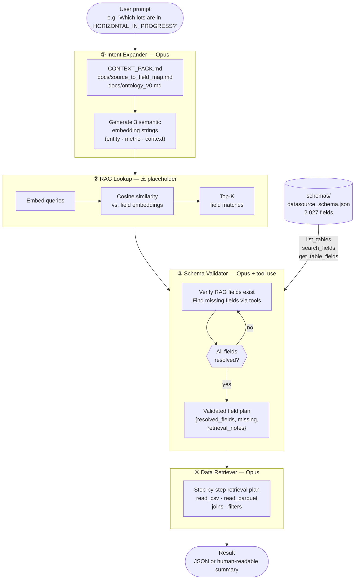

# Query Pipeline

Natural-language data retrieval for the Flagship Homes development ontology.
Takes a plain-English prompt, expands it into semantic search strings, matches
against the field registry, validates schema coverage, and produces a
step-by-step retrieval plan.

---

## Architecture



---

## Pipeline stages

### ① Intent Expander
Loads company context (`CONTEXT_PACK.md` + docs) and asks Opus to decompose the
user prompt into **3 embedding strings** from different angles:

| String | Angle |
|--------|-------|
| #1 | Entity / record type (lot, phase, project, GL transaction) |
| #2 | Measurement or metric (cost, date, status, count) |
| #3 | Temporal / contextual dimension (period, source system, join key) |

### ② RAG Lookup  ⚠️
Matches the 3 strings against pre-built embeddings of every field's
`embedding_text` in `schemas/datasource_schema.json`.

**Currently a placeholder** — returns hardcoded representative fields.
See [Wiring up real RAG](#wiring-up-real-rag) below.

### ③ Schema Validator
Receives the RAG candidate fields and the original prompt. Uses an **agentic
tool-use loop** to confirm every required field exists in the registry, calling
tools to fill gaps the RAG missed:

| Tool | Purpose |
|------|---------|
| `list_tables` | Enumerate all available tables/sources |
| `search_fields(query)` | Substring search across field name, table, and description |
| `get_table_fields(table)` | All fields for a specific table |

Outputs a validated field plan: `resolved_fields`, `missing`, `retrieval_notes`.

### ④ Data Retriever
Given the validated field plan, produces a concrete **step-by-step retrieval
plan**: which files to read, which columns to select, any filters or joins
needed, and known caveats.

Currently a planning agent — actual file I/O is the next step once the data
access layer is settled.

---

## Usage

```bash
# Human-readable summary
python3 query_pipeline.py "Which lots are in HORIZONTAL_IN_PROGRESS state?"

# Full JSON output
python3 query_pipeline.py --json "What is the total cost for BCPD phase 3?"

# Stream agent reasoning to stderr
python3 query_pipeline.py --verbose "Show lot lifecycle dates for phase 2"
```

### Output (human-readable)

```
============================================================
Query: Which lots are in HORIZONTAL_IN_PROGRESS state?
============================================================

--- Embedding Queries ---
  1. Development lot lifecycle stage tracking fields recording current ...
  2. Horizontal construction progress status indicator cost-to-date ...
  3. Phase lot identifier join key collateral source period as-of date ...

--- Schema Plan (4 fields resolved) ---
  Collateral Dec2025 01 Claude.xlsx - Lot Data . Phase  [string]
    → Phase grouping key needed to identify which phase each lot belongs to
  Collateral Dec2025 01 Claude.xlsx - 2025Status . Current Stage  [string]
    → Contains HORIZONTAL_IN_PROGRESS and other lifecycle stage values
  ...

--- Retrieval Plan (2 steps) ---
  Step 1: read_csv  ←  Collateral Dec2025 01 Claude.xlsx - 2025Status
    columns: Phase, LotNo., Current Stage
    filter:  Current Stage == HORIZONTAL_IN_PROGRESS
  Step 2: join  ←  Collateral Dec2025 01 Claude.xlsx - Lot Data
    join:    (Project, Phase, LotNo.) to enrich with lifecycle dates
```

---

## Wiring up real RAG

Replace the body of `rag_lookup()` in `query_pipeline.py`. The function
signature and return type must stay the same.

**Step 1 — build the index** (run once, re-run after schema changes):

```python
import json, numpy as np
from anthropic import Anthropic

client = Anthropic()
schema = json.load(open("schemas/datasource_schema.json"))["datasources"]
texts  = [e["embedding_text"] for e in schema]

# batch into chunks of 100 to stay within API limits
vectors = []
for i in range(0, len(texts), 100):
    resp = client.embeddings.create(
        model="text-embedding-3-small",
        input=texts[i:i+100],
    )
    vectors.extend([r.embedding for r in resp.data])

np.save("schemas/field_embeddings.npy", np.array(vectors))
```

**Step 2 — search at query time**:

```python
import numpy as np

_index    = np.load("schemas/field_embeddings.npy")   # shape (N, D)
_entries  = json.load(open("schemas/datasource_schema.json"))["datasources"]

def rag_lookup(queries: list[str], *, top_k: int = 15) -> list[dict]:
    client = Anthropic()
    resp   = client.embeddings.create(model="text-embedding-3-small", input=queries)
    q_vecs = np.array([r.embedding for r in resp.data])          # (Q, D)

    # cosine similarity: normalise then dot
    q_norm = q_vecs / np.linalg.norm(q_vecs, axis=1, keepdims=True)
    i_norm = _index / np.linalg.norm(_index, axis=1, keepdims=True)
    scores = q_norm @ i_norm.T                                    # (Q, N)

    seen, results = set(), []
    for row in scores:
        for idx in np.argsort(row)[::-1]:
            eid = _entries[idx]["id"]
            if eid not in seen:
                seen.add(eid)
                results.append(_entries[idx])
            if len(results) >= top_k:
                break
        if len(results) >= top_k:
            break
    return results
```

The index only needs rebuilding when `datasource_schema.json` changes (i.e.
after running `schemas/enrich_descriptions.py` or `schemas/fix_descriptions.py`).

---

## Tests

```bash
# Unit tests only (no API calls, ~0.1 s)
pytest tests/test_query_pipeline.py -v -k "not e2e"

# End-to-end tests (requires ANTHROPIC_API_KEY)
pytest tests/test_query_pipeline.py -v -k e2e
```

| Test class | What it covers |
|------------|----------------|
| `TestExtractJson` | JSON extraction from plain text, fenced blocks, prose |
| `TestSchemaTools` | `list_tables`, `search_fields`, `get_table_fields` vs. real schema |
| `TestDispatchTool` | Tool routing + unknown-tool error |
| `TestRagLookup` | Return type, required keys, determinism |
| `TestLoadCompanyContext` | Context files load and contain expected terms |
| `TestGenerateEmbeddingQueries` | Mocked client: parsing, fence stripping, model selection |
| `TestValidateSchema` | No-tool path, tool loop, tool results wired back, multi-turn |
| `TestRetrieveData` | JSON parsing, malformed fallback, schema plan forwarded |
| `TestRunPipeline` | Full pipeline wiring, 3 API calls, RAG determinism |
| `TestCli` | `--json` and human-readable output, missing fields, caveats |
| `TestE2E` | Live API: 3 queries, resolved fields, retrieval steps, no file mutation |
