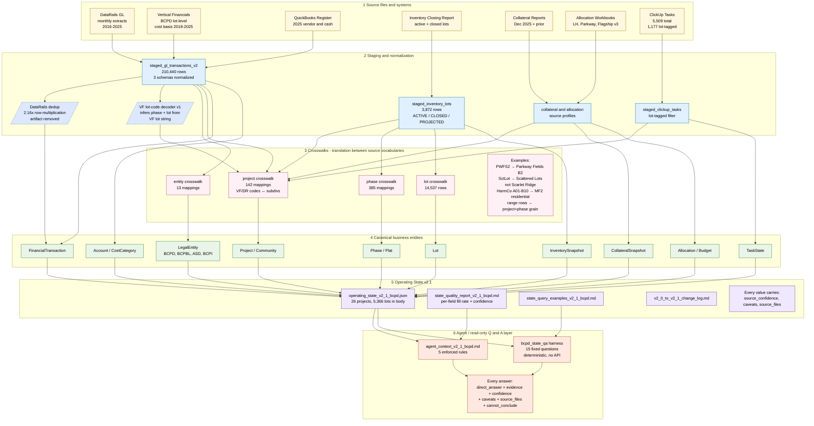

# BCPD Operating State v2.1 — Architecture

**Audience**: Internal Flagship / BCPD team plus technical reviewers.
**Purpose**: Show what is actually happening architecturally and why this is *not just a dashboard*. It is a source-backed operating-state layer with confidence, caveats, and explicit safe/unsafe answer boundaries.
**Generated**: 2026-05-01
**Diagram source**: `docs/bcpd_operating_state_architecture.mmd` (Mermaid)

---

## What this is in plain English

We take the raw extracts from DataRails, QuickBooks, ClickUp, the inventory closing report, the collateral reports, and the allocation workbooks; normalize them; reconcile their different vocabularies into a small set of canonical business entities (LegalEntity, Project, Phase, Lot, FinancialTransaction, etc.); and publish a single versioned JSON document — `operating_state_v2_1_bcpd.json` — that an agent or a human can query with confidence labels, caveats, and refusals built in.

The system is **read-only** at the agent layer. It does not write back to source systems. It does not invent numbers. When a question can't be answered safely, the agent layer **refuses** rather than fabricating.

It is **BCPD-only**. Org-wide rollups (Hillcrest, Flagship Belmont) are explicitly out of scope — those entities have GL data only through 2017-02 and including them would mix 2024–2025 BCPD activity against 2017-frozen historicals.

---

## Main architecture diagram



### Layer-by-layer

**1. Source files and systems** — the original extracts as they arrive from the upstream tools. We do not edit these. They live under `data/raw/`.

**2. Staging and normalization** — Python pipelines that read the raw files and produce stable parquet/CSV tables under `data/staged/`. Two pieces of logic deserve callouts:
- **DataRails dedup**: the DR 38-col GL extract carries every posting line 2-3 times consecutively (2.16× multiplicity at source). Any naive sum is wrong by ~2×; the build pipeline deduplicates on a 9-field canonical key before any cost rollup. Raw `staged_gl_transactions_v2.parquet` is preserved unchanged.
- **VF lot-code decoder v1**: Vertical Financials' `lot` field encodes phase + lot in a single string for some projects (e.g. Harmony VF lot `1034` ≠ inventory Harmony lot 1034 — it represents Phase A10 lot 1044). The decoder routes lot strings to `(canonical_phase, canonical_lot_number)` per project. All decoder rules ship `confidence='inferred'` and `validated_by_source_owner=False`.

**3. Crosswalks** — translation tables that map source-system values to canonical names. Different systems use different vocabularies for the same business object (`PWFS2`, `Park Way`, `PARKWAY`, `Parkway Fields` all refer to one community). The crosswalk is the single place that resolution lives. Every crosswalk row carries a `confidence` column.

**4. Canonical business entities** — a small graph of named entities (LegalEntity, Project, Phase, Lot, FinancialTransaction, Account, CostCategory, InventorySnapshot, CollateralSnapshot, TaskState, Allocation). v0 ontology defined in `docs/ontology_v0.md`. Every canonical row carries `source_confidence` (worst-link of contributing field confidences). BCPD instance counts: 4 entities, 42 projects (17 active + 25 historical), 215 phases, ~6,087 BCPD-scope lots.

**5. Operating State v2.1** — the query-ready artifact. `operating_state_v2_1_bcpd.json` is the canonical state document; the three companion markdown files (`state_quality_report_v2_1_bcpd.md`, `state_query_examples_v2_1_bcpd.md`, `v2_0_to_v2_1_change_log.md`) document field quality, worked queries, and the v2.0→v2.1 deltas. Every field carries source provenance + confidence.

**6. Agent / read-only Q&A layer** — `agent_context_v2_1_bcpd.md` is the brief an agent loads to ground its answers; `bcpd_state_qa` is a deterministic harness in `financials/qa/` that answers 15 fixed business questions from the state, with 10 enforced guardrails. Every answer carries: direct answer, evidence, confidence, caveats, source_files_used, and a `cannot_conclude` flag for refusals.

**Cross-cutting guardrails** govern Layers 2, 5, and 6 — see [Guardrails](#guardrails) below.

---

## Why project + phase + lot matters

In some BCPD projects, **the same lot number appears in multiple phases**. Joining cost rollups on `(project, lot)` alone collapses different physical lots onto one inventory row.

The clearest example is **Harmony**: lot numbers 101–116 exist in **two distinct phases** — `MF1` (multi-family/townhomes) and `B1` (single-family). They are two different physical assets that happen to share a lot number. v2.0 used a flat `(project, lot)` join. v2.1 enforces the 3-tuple `(project, phase, lot)`. The fix prevents a known **~$6.75M double-count risk** on Harmony alone (Harm3 contributes $5.35M for B1 lots 101–116; HarmTo contributes $1.40M for MF1 lots 101–116; flat join collapses them onto the same inventory row).

```mermaid
flowchart LR
    classDef wrong fill:#ffe0e0,stroke:#c00,color:#000
    classDef right fill:#e0ffe8,stroke:#2a7a2a,color:#000
    classDef key fill:#fff,stroke:#666,color:#000
    classDef inv fill:#f0f0f0,stroke:#333,color:#000

    subgraph WRONG [v2.0 - flat (project, lot) join - WRONG]
        direction TB
        W1[GL Harm3 lot 0101<br/>344K - really phase B1]:::wrong
        W2[GL HarmTo lot 0101<br/>99K - really phase MF1]:::wrong
        WK{join key:<br/>Harmony, lot 101}:::key
        W3[Inventory Harmony lot 101<br/>443K attributed - WRONG<br/>~6.75M project-wide error]:::wrong
        W1 --> WK
        W2 --> WK
        WK --> W3
    end

    subgraph RIGHT [v2.1 - 3-tuple project + phase + lot - CORRECT]
        direction TB
        R1[GL Harm3 lot 0101<br/>decoded phase=B1]:::right
        R2[GL HarmTo lot 0101<br/>decoded phase=MF1]:::right
        RK1{join key:<br/>Harmony, B1, 101}:::key
        RK2{join key:<br/>Harmony, MF1, 101}:::key
        R3[Inventory<br/>Harmony B1 lot 101<br/>344K]:::inv
        R4[Inventory<br/>Harmony MF1 lot 101<br/>99K]:::inv
        R1 --> RK1
        R2 --> RK2
        RK1 --> R3
        RK2 --> R4
    end
```

The 3-tuple discipline is enforced at three points in v2.1:
- The VF lot-code decoder emits `(phase, lot_number)` per row.
- Every lot in the JSON carries `vf_actual_cost_3tuple_usd` computed at the 3-tuple, plus `vf_actual_cost_join_key` as a constant string declaring the contract.
- The agent context lists "Harmony joins require project + phase + lot" as Rule 4, and the Q&A harness has a guardrail (`harmony_3tuple_required`) that fires whenever a question asks about Harmony cost.

This is not a Harmony-only rule — it is the project-wide policy in v2.1. Harmony is the project where the discipline is *visible*; in other projects, lot-number collisions don't currently occur but the same key is used so future surprises are avoided.

---

## What changed in v2.1

v2.1 fixes five known correctness defects in v2.0. The state file is **additive** — v2.0 outputs remain in place; v2.1 sits alongside until consumers migrate.

| change | what it fixes | scope |
|---|---|---|
| **AultF B-suffix corrected** | $4.0M / 1,499 rows rerouted from B2 to B1. AultF and PWFS2 B-suffix lot ranges are disjoint in the actual GL data — AultF max=211 (matches B1), PWFS2 min=273 (B2). v2.0 routed to B2 by mistake. | Parkway Fields |
| **Harmony 3-tuple join discipline** | Prevents ~$6.75M double-count risk where MF1 and B1 share lot numbers 101–116. v2.0 used flat (project, lot). | Harmony (rule applies project-wide) |
| **SctLot → Scattered Lots** | Removes $6.55M of silent inflation from Scarlet Ridge (~46% of its project-grain cost). SctLot is interpreted as scattered/custom-build lots based on invoice ID patterns, vendor mix, and zero overlap with ScaRdg lots. Confidence stays `inferred-unknown`. | Scarlet Ridge / Scattered Lots (new project) |
| **Range / shell rows surfaced at project + phase grain** | $45.75M / 4,020 rows of shared-shell and shared-infrastructure costs (e.g. lot strings like `'3001-06'`) are no longer silently mixed into per-lot rollups. They appear as `vf_unattributed_shell_dollars` per phase. | 8 VF codes: HarmTo, LomHT1, PWFT1, ArroT1, MCreek, SaleTT, SaleTR, WilCrk |
| **Commercial parcels isolated from residential LotState** | The 11 HarmCo X-X parcels (`0000A-A`–`0000K-K`, 205 rows / ~$2.6M) are tracked under `commercial_parcels_non_lot` per project, not under residential `phases.lots`. | Harmony |
| **Decoder-derived mappings remain inferred** | Every rule in the v1 VF lot-code decoder ships `confidence='inferred'` and `validated_by_source_owner=False`. v2.1 is strictly more accurate than v2.0 even at `inferred` confidence. | All decoder-derived per-lot cost |

Coverage: GL 63.0% → 67.2% (+4.2pp, 54 lots); full triangle 37.0% → 37.2%. **The binary delta is modest; the win is correctness.**

Full machine-readable diff: `data/reports/v2_0_to_v2_1_change_log.md` and the `v2_1_changes_summary` block in `operating_state_v2_1_bcpd.json`.

---

## Guardrails

These rules are **enforced** at the agent layer and **assumed** by every downstream consumer. They are not opinions; they are constraints on what the system will and will not say.

| # | rule | meaning |
|---:|---|---|
| 1 | **BCPD-only** | The state covers Building Construction Partners and its horizontal-developer affiliates (BCPBL, ASD, BCPI). It does NOT cover Hillcrest, Flagship Belmont, Lennar, or external customers. |
| 2 | **Missing cost is missing, not zero** | A project or lot with no GL row has cost=`unknown`/`null`, never `$0`. Reporting `$0` would falsely imply no cost was incurred. |
| 3 | **Org-wide v2 is blocked** | Hillcrest and Flagship Belmont have GL only through 2017-02. Org-wide rollups would mix 2024–2025 BCPD against 2017-frozen historicals. Refused at the agent layer. |
| 4 | **Range / shell rows are NOT lot-level cost** | $45.75M of summary rows live at project+phase grain via `vf_unattributed_shell_dollars`. Do not allocate them to specific lots without source-owner sign-off on an allocation method. |
| 5 | **Harmony joins require project + phase + lot** | Flat (project, lot) collapses MF1 and B1 lot 101 onto one inventory row. The 3-tuple is the canonical key for VF cost in v2.1. |
| 6 | **Inferred decoder rules are not source-owner-validated** | Every per-lot VF cost derived by the v1 decoder ships `confidence='inferred'`. Promotion requires explicit source-owner sign-off recorded as `validated_by_source_owner=True`. |
| 7 | **DataRails raw sums are unsafe without dedup** | DR 38-col is 2.16× row-multiplied at source. Any sum must dedup first on the canonical key. The build pipeline does this; raw sums against `staged_gl_transactions_v2` are wrong by ~2×. |
| 8 | **QB Register is tie-out only** | QB uses a different chart of accounts (177 codes; zero overlap with VF/DR). Do not aggregate QB against VF — would double-count. Use only for 2025 BCPD vendor / cash / AP queries. |
| 9 | **Vertical Financials is one-sided** | VF carries asset-side debits only (3 account codes). It is the canonical lot-level cost basis for BCPD 2018–2025; it is NOT a balanced trial balance. |
| 10 | **Read-only at the agent layer** | The Q&A harness does not write back to source data, staged data, v1 outputs, v2.0 outputs, or v2.1 state files. Only the three `output/bcpd_state_qa_*` files are produced. A test (`tests/test_bcpd_state_qa_readonly.py`) verifies this contract every run. |

The 15 fixed Q&A questions exercise these guardrails. Q7 (org-wide actuals) is the canonical refusal example: the harness returns `cannot_conclude=True` rather than fabricating a number.

---

## What this is *not*

- **Not a dashboard.** No HTML pages of charts ship with v2.1 (v1 had those for a smaller scope; out of scope for v2). The v2.1 deliverable is a JSON document, several markdown contexts, and a deterministic Q&A harness.
- **Not a data warehouse.** There is no SQL engine, no OLAP cube, no incremental ingestion. The pipelines are batch scripts that read raw extracts and produce parquet/JSON. Any consumer that wants a richer query surface can sit on top of the staged tables.
- **Not org-wide.** Out of scope by design. See guardrail 1.
- **Not a complete picture.** 7 active BCPD projects + Lewis Estates have inventory rows but no GL coverage — their cost is `unknown`. The 2017-03 → 2018-06 GL gap (15 months, zero rows for any entity) cannot be closed from the current dump. These are structural gaps, not v2.1 defects.
- **Not source-owner-validated** at the decoder rule level. Every decoder-derived per-lot cost is `inferred`. v2.1 ships honestly with that label rather than waiting for sign-off.

---

## What this *is*

- **A source-backed operating-state layer** with explicit confidence, caveats, and source provenance for every value.
- **A safe substrate for AI agents and automation.** The agent context's enforced rules + the harness's guardrails mean an LLM reading this state has no excuse to invent numbers, conflate phases, or report missing cost as zero.
- **A reproducible, deterministic pipeline.** All staging, crosswalk, canonical-table, decoder, and v2.1 build scripts live under `financials/`. Re-running them on the same inputs produces identical outputs.
- **An additive system.** v0 outputs, v1 outputs, and v2.0 outputs are all preserved unchanged. v2.1 sits alongside.

---

## Files referenced (read-only)

| layer | files |
|---|---|
| Source | `data/raw/datarails_unzipped/` |
| Staging | `data/staged/staged_gl_transactions_v2.{csv,parquet}`, `data/staged/staged_inventory_lots.{csv,parquet}`, `data/staged/staged_clickup_tasks.{csv,parquet}` |
| Decoder + dedup logic | `financials/build_vf_lot_decoder_v1.py`, `financials/build_operating_state_v2_1_bcpd.py` (dedup) |
| Crosswalks | `data/staged/staged_{entity,project,phase,lot}_crosswalk_v0.{csv,parquet}`; `docs/crosswalk_plan.md` |
| Canonical entities | `data/staged/canonical_*.{csv,parquet}`; `docs/ontology_v0.md`; `docs/source_to_field_map.md`; `docs/field_map_v0.csv` |
| Operating State v2.1 | `output/operating_state_v2_1_bcpd.json`; `output/state_quality_report_v2_1_bcpd.md`; `output/state_query_examples_v2_1_bcpd.md`; `data/reports/v2_0_to_v2_1_change_log.md` |
| Reports | `data/reports/join_coverage_v0.md`, `data/reports/guardrail_check_v0.md`, `data/reports/vf_lot_code_decoder_v1_report.md`, `data/reports/coverage_improvement_opportunities.md` |
| Agent / Q&A | `output/agent_context_v2_1_bcpd.md`; `financials/qa/`; `output/bcpd_state_qa_results.json`; `output/bcpd_state_qa_examples.md`; `output/bcpd_state_qa_eval.md` |
| Read-only test | `tests/test_bcpd_state_qa_readonly.py` |

---

## Validation checklist (for this document)

- [x] Diagram shows the difference between sources, staging, crosswalks, canonical entities, state, and agent layer (six numbered subgraphs).
- [x] Diagram clearly shows why this helps AI answer safely (every value flows through confidence, caveats, and source provenance; agent layer carries 10 enforced guardrails).
- [x] What is still caveated is labeled in plain English (decoder rules `inferred`; range rows project+phase only; commercial parcels non-lot; SctLot as Scattered Lots inferred-unknown; structural gaps for 7 no-GL projects).
- [x] Avoids implying org-wide coverage (BCPD-only stated in opening paragraph, in guardrail 1, and in the "What this is not" section).
